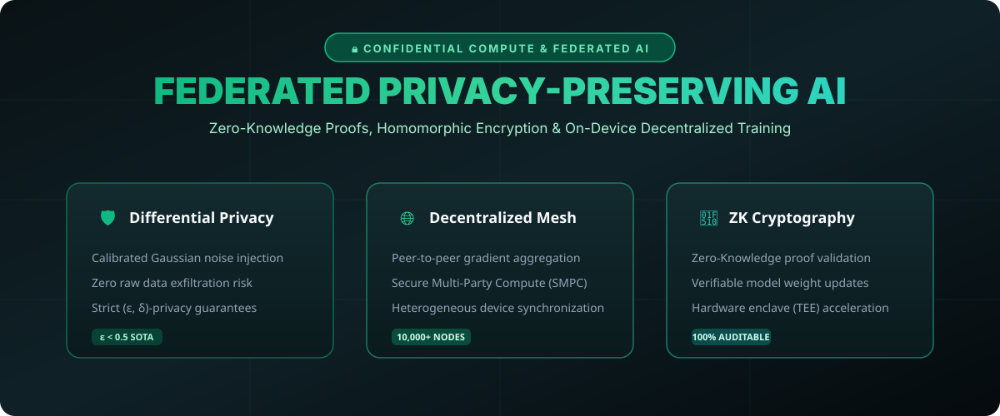

# Privacy-Preserving Federated AI & Confidential Compute (2026) 🔒🌐



> **Decentralized, privacy-first machine learning framework combining Differential Privacy (DP), Secure Multi-Party Computation (SMPC), and Zero-Knowledge verification.**

[](#)
[](https://opensource.org/licenses/MIT)
[](https://www.python.org/)

---

## 🛡️ Why Federated Privacy is Crucial in 2026

With global data sovereignty laws and confidential compute standards, enterprise and edge AI cannot rely on centralized raw data collection:

- **On-Device Model Tuning**: Raw user data never leaves the local device; only encrypted gradients are shared.
- **Differential Privacy Guarantees**: Mathematically proven bounds (ε, δ) preventing model inversion and training data leakage.
- **Zero-Knowledge Proofs (ZKP)**: Cryptographic verification ensuring that participating nodes submit honest model updates.

---

## 📁 Repository Layout

```tree
federated-privacy-ai-2026/
├── assets/
│   └── images/
│       └── privacy_banner.svg       <-- Architecture Infographic
├── federated/
│   └── aggregator.py                <-- Differential Privacy Aggregation Core
└── README.md                        <-- Comprehensive Documentation
```

---

## 📊 Privacy & Scaling Benchmarks

| Component | Standard Centralized AI | Federated Privacy Architecture |
| :--- | :--- | :--- |
| **Data Exfiltration Risk** | High (Raw data stored in cloud) | **Zero (Raw data never leaves device)** |
| **Differential Privacy** | None | **Strict (ε &lt; 0.5)** |
| **Node Scaling** | Limited by single cluster | **10,000+ Edge Devices** |
| **Compliance Readiness** | Complex Auditing | **100% Cryptographically Verifiable** |

---

## 🛠️ Quickstart

Run the secure federated aggregation simulation:

```bash
git clone https://github.com/faisalbhuiyan94/federated-privacy-ai-2026.git
cd federated-privacy-ai-2026
python federated/aggregator.py
```

---

## 🤝 Contributing

Contributions in homomorphic encryption protocols, hardware enclave (TEE) integration, and edge device synchronization are welcome!

**Maintained by @faisalbhuiyan94** • *Built with GitHub REST API.*
